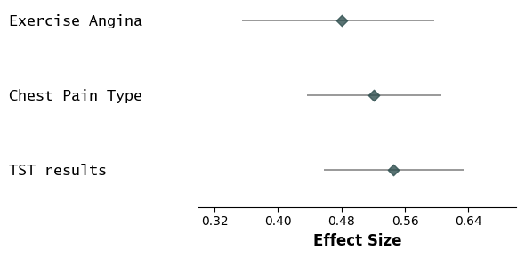
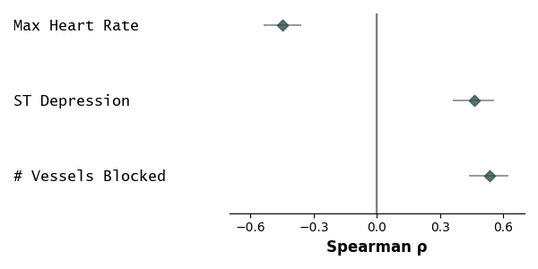
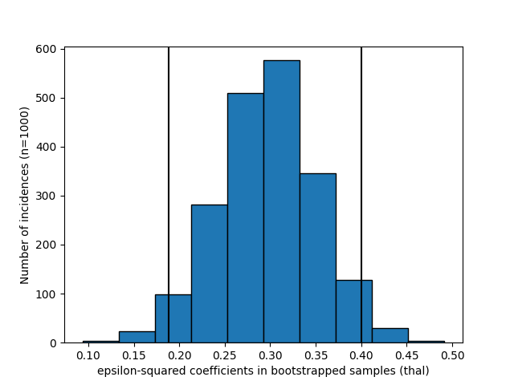
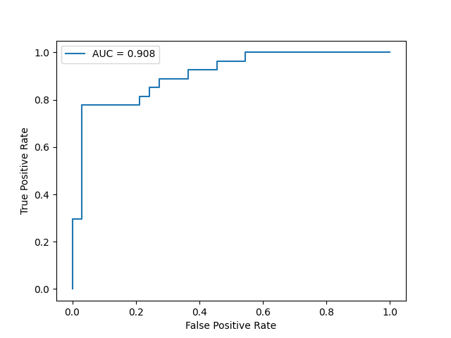

# CAD Predictor Analysis Using Non-Parametric Methods

# Overview

In this notebook, I aim to identify the top predictors of heart disease severity out of the 13 features collected by the UCI researchers and use those features to train an accurate predictive machine learning algorithm.

# Objectives

- Identify predictors of CAD presence and severity
- Rank top categorical and numerical predictors
- Estimate uncertainty with bootstrap confidence intervals
- Build an accurate logistic regression classification model
- Compare univariate and multivariate analyses

# Dataset

This project analyzes the [UCI Heart Disease Database](https://archive.ics.uci.edu/dataset/45/heart+disease), specifically from the Cleveland dataset. This dataset contains 303 patients each with 13 features and 1 target variable. 

# Technologies Used

- Python
- pandas
- NumPy
- SciPy
- matplotlib
- seaborn
- forestplot
- scikit-learn
- Jupyter Notebook

# Methods

## Data Cleaning
- handling missing values
- listwise deletion

## Exploratory Analysis
- descriptive statistics
- visualizations

## Statistical Testing
- t-tests
- Cohen's d
- Mann-Whitney U
- Rank-biserial
- Kruskal-Wallis
- Dunn's post-hoc 
- Spearman &rho;

## Uncertainty Estimation
- Bootstrap confidence intervals
- Histogram visualization
- p-values

## Predictive Modeling
- preprocessing (scaling & one-hot encoding)
- logistic regression
- ROC/AUC evaluation

# Key Findings

Through the analysis, the top numerical risk factors/predictors of CAD in the database were revealed to be 

1. Major Vessels Blocked  
2. Oldpeak  
3. Maximum Heart Rate  

and the top categorical risk factors/predictors were  

1. Fixed/Reversible Defects (TST)  
2. Chest Pain  
3. Exercise-Induced Angina  

Moreover:

- Bootstrap confidence intervals suggested results generalize to a wider population.
- Logistic regression classification model was trained to 87% accuracy and 0.94 ROC AUC score to predict presence or absence of CAD 

# Visualizations

  
*Figure 1: Top categorical predictors of CAD*

  
*Figure 2: Top numerical predictors of CAD*

  
*Figure 3: Frequency of epsilon-squared values in bootstrap samples (thal)*

  
*Figure 4: ROC curve for logistic regression classification model*

# References 

1. Janosi, A., Steinbrunn, W., Pfisterer, M., & Detrano, R. (1989). Heart Disease [Dataset]. UCI Machine Learning Repository. https://doi.org/10.24432/C52P4X
2. Shams P, Gul Z, Makaryus AN. Silent Myocardial Ischemia. [Updated 2024 Mar 7]. In: StatPearls [Internet]. Treasure Island (FL): StatPearls Publishing; 2026 Jan-. Available from: [https://www.ncbi.nlm.nih.gov/books/NBK536915/](https://www.ncbi.nlm.nih.gov/books/NBK536915/)
3. Wackers FJ. Comparison of thallium-201 and technetium-99m methoxyisobutyl isonitrile. Am J Cardiol. 1992 Nov 5;70(14):30E-34E. Available from: [https://doi.org/10.1016/0002-9149(92)90036-X](https://doi.org/10.1016/0002-9149(92)90036-X)
3. Spleen AM, Lengerich EJ, Camacho FT, Vanderpool RC. Health care avoidance among rural populations: results from a nationally representative survey. J Rural Health. 2014;30:79–88. Available from: https://doi.org/10.1111/jrh.12032

# Author

My name is Adan Sheik. As a long-time resident of Northeast Ohio and aspiring bioinformaticist, I am very passionate about this project, and plan to make additions in the future. Let me know if you want to connect!

- [Linkedin](https://www.linkedin.com/in/adan-sheik-391400339/)
